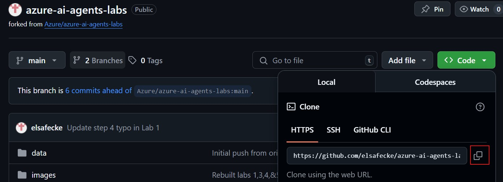

# Hands-On Labs for AI Agents Using Azure AI Agent Service UI and SDK

This repository provides a series of hands-on labs for building and orchestrating AI Agents using the Azure AI Agent Service SDK. You will learn to set up your Azure environment, deploy models, create and connect agents, and build advanced multi-agent systems.

## Prerequisites

Below is a list of prequisites that are required in order to run the labs. Please read through carefully to ensure these or met to avoid errors when running the labs.

### 1. Azure subscription
- You must have an active Azure subscription and be able to log into the Azure Portal to use Azure services in these labs. Don't have a subscription? Most of the content in these labs provide thorough walkthroughs and explanations of the code and output, so whether or not you are actually able to run the labs, you can still learn a lot by reading through them!

### 2. Install Visual Studio Code (required if running locally)
- Download and install VS Code from: https://code.visualstudio.com/

### 3. Install Python (required if running locally)
- Download and install Python (version 3.10 or higher) from: https://www.python.org/downloads/
- During installation, check the box to "Add Python to PATH".

### 4. Install the Azure CLI (required if running locally)
- Download and install the Azure CLI from: https://learn.microsoft.com/cli/azure/install-azure-cli
- After installation, open a new terminal and run `az --version` to verify installation.

### 5. Install Git (required if running locally)
- Download and install Git from: https://git-scm.com/downloads
- Follow the installation instructions for your operating system (Windows, macOS, or Linux).
- After installation, open a new terminal or command prompt and run `git --version` to verify Git is installed correctly.

### 6. Install the Azure CLI Tools Extension in VS Code (required if running locally)
- In VS Code, go to Extensions (Ctrl+Shift+X).
- Search for and install: **Azure CLI Tools** (`ms-vscode.azurecli`).

### 7. Install the Azure Resource Extension in VS Code (recommended if running locally)
- In VS Code, go to Extensions.
- Search for and install: **Azure Account** (`ms-vscode.azure-account`).

### 8. Create a Github account (required if running in Github Codespaces)
- This is only required if you wish to run the labs in Github Codespaces.
- Note: your organization may have certain security policies in place that prevent running Labs in the cloud. In that case, please proceed with option #1

## How to Get Started

If you are running the labs locally...

1. Clone the repo by copying the URL 

   

2. Open VS Code. On the main page, select 'Clone git repository' and paste the URL you just copied into the top window. It will ask you where you want to save the folder, that is up to you.

   

If you are running the labs in Github Codespaces...

1. Select Codespaces and create a new workspace. That's it!

   

## Labs Overview

- **Lab 1: Environment Setup and Testing**  
  Set up your Azure AI Foundry project, deploy LLM and embedding models, connect from VS Code, and verify your environment with a test chat completion.

- **Lab 2: Create an AI Agent in Azure AI Foundry UI**  
  Use the low-code UI to build an AI agent that extracts answers from Excel files and retrieves real-time information from Bing Search.

- **Lab 3: Build a Simple AI Agent**  
  Develop a Python-based AI agent in Azure that generates a bar chart comparing health insurance plan costs.

- **Lab 4: Build a Retrieval Augmented Generation (RAG) Agent**  
  Create an AI agent that performs RAG on health plan documents using Azure AI Search as a vector database for embeddings.

- **Lab 5: Develop a Multi-Agent System**  
  Build a system of four collaborating agents: a Search Agent (queries Azure AI Search), a Report Agent (generates detailed reports), a Validation Agent (checks report requirements), and an Orchestrator Agent (manages agent interactions).

Each lab is designed to be practical and builds on the previous, giving you hands-on experience with Azure AI services, agent orchestration, and real-world AI solutions.
